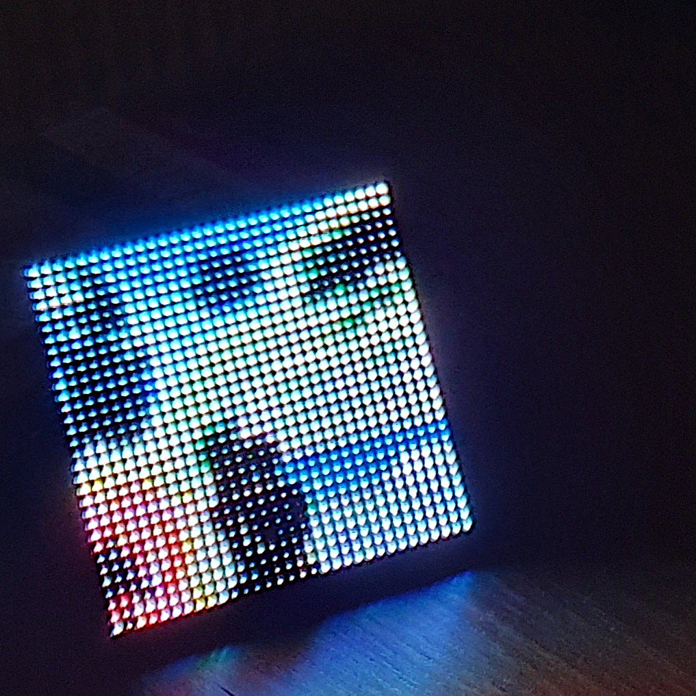

# thirtytwopixels

<div align="center">
    
</div>

> wireless LED album art display for mpd+ncmpcpp (and possibly other players)

## Hardware

- Raspberry Pi Zero WH
- [Adafruit RGB Matrix Bonnet](https://www.adafruit.com/product/3211)
- A 32x32 LED matrix with a HUB75 connection (available on e.g. Adafruit, Pimoroni, Aliexpress). I used [this one](https://shop.pimoroni.com/products/rgb-led-matrix-panel?variant=35962488650).
- A 5V 4A power adapter

Refer to the [Adafruit instructions](https://learn.adafruit.com/adafruit-rgb-matrix-bonnet-for-raspberry-pi/) to set it up.
I recommend to do [the PWM mod](https://github.com/hzeller/rpi-rgb-led-matrix#improving-flicker), it completely removed noticeable flicker for me. This requires minor soldering.

## Setup

The project is split into two parts:

- a client script that is invoked from `ncmpcpp`'s config hooks
- a server script that runs on a raspberry pi connected to the LED matrix

Communication between client and server is handled by a 0MQ TCP socket.

### Client

Clone or fork this repo:

``` sh
git clone https://github.com/fspoettel/thirtytwopixels
```

Install required modules:

```sh
pip3 install -r requirements.txt
```

Add the following lines to `~/.ncmpcpp/config`:

```conf
# errors and output is appended to syslog
execute_on_song_change="(path_to_repo/on_song_change.py &> /dev/null &)"
execute_on_player_state_change = "(path_to_repo/on_player_state_change.py &> /dev/null &)"
```

Make sure that our hooks are executable:

```sh
chmod +x on_song_change.py
chmod +x on_player_state_change.py
```

If your pi is not using the hostname `raspberrypi.local`, you will need to adjust `ZMQ_HOST` in `./client/matrix.py`.

> ℹ️ It is assumed that `cover.{jpg,png}` files are stored in the album folders alongside music files. If that is not the case, you'll need to implement a module analogous to `./client/mpd.py` and call its `get_cover` method in `./on_song_change.py`. The method should return an absolute file system path to an image.

### Server

Clone this repo **recursively** to include the [rgb-led-matrix](https://github.com/hzeller/rpi-rgb-led-matrix) submodule:

```sh
git clone --recursive https://github.com/fspoettel/thirtytwopixels
```

Install required modules. Note that the script **needs to use** sudo to interface with the hardware:

```sh
sudo pip3 install -r requirements.txt
```

Setup [rpi-rgb-led-matrix](https://github.com/hzeller/rpi-rgb-led-matrix):

```sh
cd matrix
make build-python PYTHON=$(which python3)
sudo make install-python PYTHON=$(which python3)
```

Set / adjust panel options in `server.py`:

```py
def matrix_factory(width):
    options = RGBMatrixOptions()
    # ...
    panel = RGBMatrix(options=options)
    return panel

```

Run the server:

```sh
sudo python3 server/server.py
```

Once you are happy with the panel config, you can add the server as a `systemd` service which is started at startup. To do that, create the following file at `/etc/systemd/system/thirtytwopixels.service`:

```sh
[Unit]
Description=thirtytwopixels tcp server

[Service]
ExecStart=/usr/bin/python3 /usr/local/lib/thirtytwopixels/server/server.py

[Install]
WantedBy=default.target
```

and move the repo to `/usr/local/lib/`:

```sh
mv thirtytwopixels /usr/local/lib/
sudo chown root:root /usr/local/lib/thirtytwopixels/server/server.py
sudo chmod 644 /usr/local/lib/thirtytwopixels/server/server.py
```

You can then enable the service via:

```sh
sudo systemctl enable thirtytwopixels.service
```

## Pictures

<div align="center">
    
</div>

<div align="center">
    
</div>
